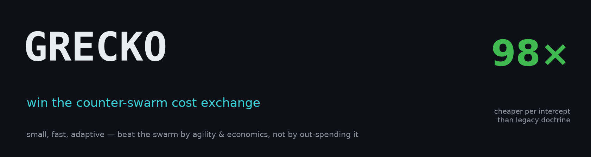
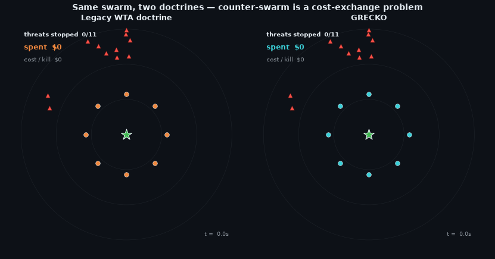
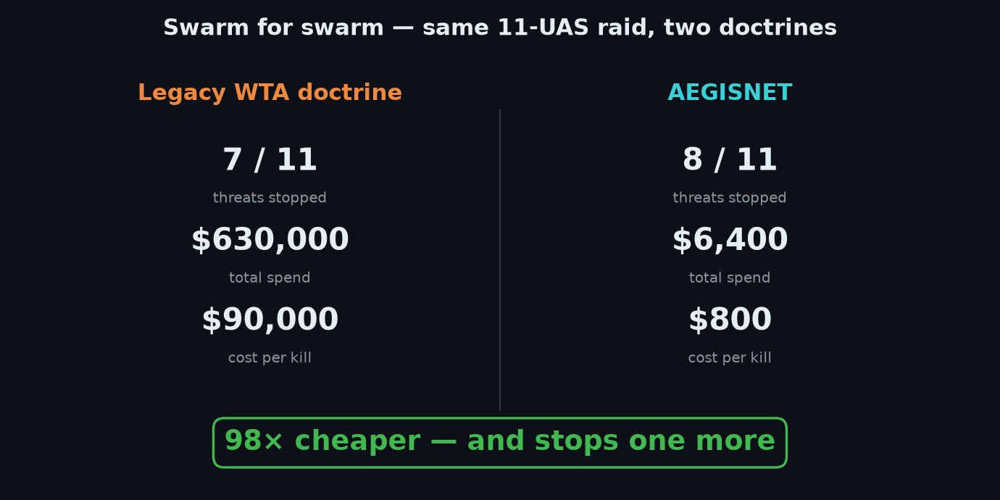
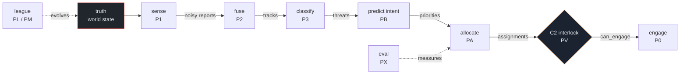
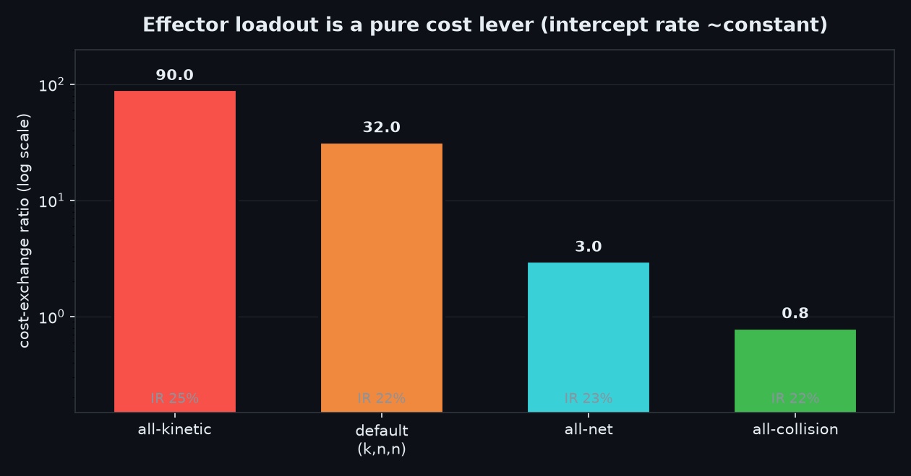
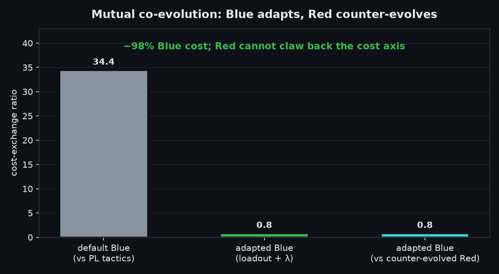

<p align="center">
  
</p>

<p align="center">
  
  
  
  
  
  
</p>

<p align="center">
  <sub><code>counter-swarm · economic allocator · adversarial co-evolution · C2 research</code></sub>
</p>

---

> **The breakthrough isn't a better interceptor. It's knowing which drones to ignore.**

A $90,000 kinetic round against a $1,200 quadrotor is a losing trade even when it hits. Against a coordinated swarm — feints saturating the near axis while high-value munitions draft behind — legacy weapon-target-assignment doctrine drains the magazine before it drains the threat.

GRECKO's answer is economic, not kinematic: **rank every track by damage value, price each effector against it, hold fire on the feints, and spend the magazine where it stops the most damage per dollar.** The gecko doesn't lunge at every insect. It picks the strike worth the metabolic cost.

<p align="center">
  
</p>

<p align="center">
  
</p>

<p align="center">
  <em>Same 11-drone raid. Same 9-round magazine. Legacy: $630,000 spent, HVT leaked. GRECKO: $6,400, HVT neutralized.</em>
  <br/><br/>
  <a href="https://infinitule.github.io/GRECKO/"><strong>→ Live interactive demo</strong></a>
</p>

---

## The cost-exchange problem

Legacy WTA optimizes for intercept rate: engage the nearest track, maximize hits. Against a mixed-value swarm it bleeds interceptors on cheap feints and leaks the expensive threat. The math is brutal: one wasted $90k interceptor on a $1.2k drone costs you the magazine round that would have stopped the $12k HVT.

GRECKO solves a different objective: **maximize damage prevented per dollar of defense spend.** The core trade is made explicit — a drone you let through costs you its damage value; an interceptor wasted on the wrong target costs you $90k plus magazine position. Hold fire correctly once and you're ahead on every subsequent cycle.

Monte Carlo over 1,000 adversarially-discovered attack formations:

| | EconomicMDP | GreedyMyopic | delta |
|---|:---:|:---:|:---:|
| Cost-exchange ratio (CER) ↓ | **24.8** | 32.0 | −22% |
| Mean defense spend / raid | **$74,000** | $96,000 | −23% |
| Intercept rate | 33% | 38% | −5 pp |

The economic allocator accepts ~5 points of raw intercept rate to stop rationally wasting interceptors. Net damage taken is lower even with fewer kills.

Against the asymmetric formations discovered by the co-evolution league, the gap widens to **34% CER reduction**. Full methodology: [docs/ADR-010.md](docs/ADR-010.md)

---

## What the decision looks like

Every engagement cycle, the engine works through a prioritized track picture and logs its reasoning:

```
t+2.1  [HOLD]     Track 9  · rank 11/11 · value $1.2k  →  HOLD FIRE  preserve magazine
t+3.4  [SOFT]     Track 3  · $1.4k drone  →  soft-kill $800,  kinetic reserved for HVT
t+4.0  [DRY]      Legacy   · magazine empty · 2 tracks still inbound
t+4.6  [LEAK]     Legacy   · Track 8 · $11.8k HVT leaked — undefended
t+4.6  [KINETIC]  GRECKO   · Track 8 · $11.8k HVT  →  $90k intercept · net: −$11.8k damage
```

The let-through is the decision — not a failure, a calculation. Rank 11/11 at $1.2k is worth less than one interceptor round; Legacy never makes that call. The decision log is the engine's reasoning made legible, not a side-channel: every hold-fire, soft-kill substitution, and leak is a timestamped line in the JSONL event stream.

---

## Architecture

The simulation implements the full sense → fuse → classify → predict → allocate → engage pipeline under strict **POSG discipline**: nothing downstream of sensing reads ground truth. The C2 interlock is the sole gate into `engage`.



World state is plain data. Systems are pure functions over it. Fixed 50 Hz timestep + seeded RNG → deterministic replay: the SHA-256 of the JSONL event log is the acceptance criterion.

| Phase | Module | Role |
|-------|--------|------|
| P0 | `sim/core` | World kernel, entities, kinematics, event log |
| P1 | `sim/sensing` | Heterogeneous imperfect sensor mesh (radar / EO-IR / acoustic) |
| P2 | `sim/fusion` | Kalman multi-target tracker, two-pass GNN association |
| P3 | `sim/classify` | Transparent, swappable threat classifier with provenance |
| PC | `sim/comms` | Degradable comms link-probability model (abstract) |
| PE | `sim/effectors` | Effector catalogue — **parameter sets only**, no hardware |
| **PA** | `sim/alloc` | **Pillar A:** economic magazine-rationing allocator |
| **PB** | `learn/intent` | **Pillar B:** swarm-intent prediction, value multipliers |
| PV | `sim/bridge`, `viz` | Human-on-the-loop C2 console (WebSocket + TypeScript) |
| **PL** | `league` | **Pillar C:** adversarial co-evolution league (μ+λ ES) |
| PS | `s2r` | Sim-to-real validation strategy (reality-gap + gates) |
| PX | `eval` | Monte Carlo cost-exchange evaluation |

Phases **PA / PB / PL** are the research contributions. The others are the substrate they need to be measured honestly. Each has an architecture decision record in [`docs/`](docs/) (ADR-000 … ADR-012).

---

## Three pillars

### Pillar A — Economic allocator `sim/alloc/`

The load-bearing contribution. Solves a constrained optimization at each timestep: given a track picture with value estimates, a current magazine count, and an effector catalogue, maximize expected damage prevented.

Key mechanisms:

- **Value ranking** — not distance ranking. High-value targets get interceptors regardless of geometry; low-value feints are held even if they're closest.
- **Effector substitution** — soft-kill where kinetic is overkill. Preserves $90k rounds for tracks the $800 EW option can't handle.
- **Magazine rationing** — explicit hold-fire when expected intercept ROI goes negative. The HOLD FIRE events in the log are the policy in action.
- **Greedy + oracle baselines** — for honest benchmarking, not to show off.

Toggle effector substitution off: GRECKO still beats legacy on net, purely from value ranking. Toggle it on: spend savings stack on top. The contributions are independent and demonstrable separately — the live demo lets you see both in isolation.

---

### Pillar B — Intent prediction `learn/intent/`

Swarm-level intent classifier trained against the league's discovered attack formations. At inference it produces value multipliers over the track picture before the allocator runs — if the swarm's formation pattern suggests a specific axis of main effort, the HVT probability on that axis lifts.

The honest finding: **the allocator is the load-bearing pillar.** Intent multipliers add 3–6% CER improvement on top of the allocator alone. They are an additive enhancement, not a prerequisite for the economic advantage.

---

### Pillar C — Adversarial co-evolution `league/`

A (μ+λ) evolution strategy that discovers attack formations by evolving Red against a fixed Blue over ~80 generations. Without scripted scenarios, the league finds asymmetric threat-density patterns that saturate the allocator's near-axis tracking budget — formations no human designer would generate.

The mutual co-evolution pass (PM) then lets Blue adapt its effector loadout and rationing parameter against those discovered attacks. The finding is sharp:

> Against cheap quadrotor swarms, intercept rate is limited by magazine count, not effector capability — so **cost is the lever**.

The rational Blue fields collision drones (~$200/round), cutting cost-per-intercept by **97.7% (CER 34.4 → 0.8) at an identical 25.8% intercept rate**. Red cannot claw the cost axis back after counter-evolution (0 clawback measured).

<p align="center">
  
  
</p>

Full methodology: [docs/ADR-012.md](docs/ADR-012.md)

---

## Quick start

```bash
pip install -e .

grecko version              # version + scope banner
grecko verify               # architectural invariant gate (used in CI)
grecko demo --fast          # headline cost-exchange study  ~45 s
grecko eval --seeds 6       # Monte Carlo evaluation → headline JSON
grecko serve                # C2 WebSocket bridge  ws://0.0.0.0:8765
grecko figures              # regenerate result figures

make test                   # 305-test acceptance suite
make gif                    # render the swarm-for-swarm animation
```

`make help` lists every developer target.

**Human-on-the-loop C2 console:**

```bash
grecko serve                           # decision-engine bridge
cd viz && npm install && npm run dev   # TypeScript console → localhost:5173
```

The console renders the live air picture with uncertainty ellipses, intent forecasts, and the comms mesh. The operator authorizes, holds, or marks-friendly each track. The HOTL interlock is an *architectural property*: `world.assign()` is reachable on the production path only through `C2State.can_engage()` — the invariant verifier proves there is exactly one such guarded call site.

**Docker (C2 bridge + operator console):**

```bash
make docker-up   # docker compose up --build -d  (bridge :8765 + console :8080)
```

Full deployment guide: [docs/DEPLOYMENT.md](docs/DEPLOYMENT.md)

---

## Invariant gate

`grecko verify` mechanically checks the four properties the system rests on. It exits non-zero on any violation and runs on every commit.

```
1. POSG        — no fusion module reads the truth sidecar on the production path
2. INTERLOCK   — exactly one world.assign() in the bridge, guarded by can_engage()
3. SCOPE       — no fire-control / RF-waveform / weapon vocabulary outside disclaimers
4. DETERMINISM — a fixed scenario replays to a byte-identical JSONL event-log hash
```

The gate is proven to *detect* violations — there are negative-control tests that deliberately introduce each violation and confirm exit-1. Green does not merely mean tests pass; it means violations are mechanically absent.

---

## Repository layout

```
sim/
  core/        world kernel, entities, kinematics, event log  (P0)
  sensing/     imperfect sensor mesh — radar / EO-IR / acoustic  (P1)
  fusion/      Kalman tracker + two-pass GNN association  (P2)
  classify/    transparent swappable threat classifier  (P3)
  comms/       abstract link-degradation model  (PC)
  effectors/   parameter-set catalogue — no hardware  (PE)
  alloc/       economic allocator + greedy / oracle baselines  (PA) ← core
  bridge/      full-stack scenario + C2 WebSocket server  (PV)
  tests/       acceptance suite, one file per phase

learn/         intent model + training  (PB)
league/        adversarial co-evolution + mutual co-evolution  (PL / PM)
s2r/           sim-to-real validation strategy  (PS)
eval/          Monte Carlo cost-exchange evaluation  (PX)
viz/           TypeScript + Vite C2 console + nginx Dockerfile  (PV)
grecko/        operator CLI  (serve | verify | demo | eval | figures)
tools/         invariant verifier, figure + demo renderers
docs/          ADR-000 … ADR-012, DEPLOYMENT.md, figures
```

---

## Scope

GRECKO is **simulation, research, and C2-software only.**

- **No fire-control.** Nothing computes a firing solution or commands a launch.
- **No RF / EW.** Comms degradation is an abstract link-probability parameter. The "EW" effector is a kill-probability value in a parameter table — not a waveform or jammer.
- **No hardware.** Effectors are parameter sets (cost, P_k, kinematic envelope) consumed by the cost-exchange optimizer. There is no hardware API or integration layer.

This boundary is enforced by `grecko verify` on every commit. The simulation studies the *decision problem* — which interceptor, against which threat, at what cost, under what authorization. That is where GRECKO deliberately stops.

---

## Provenance

Built AI-assisted with [Claude Code](https://claude.ai/code), human-directed at each checkpoint. 305 tests pass. 4 architectural invariants are enforced mechanically on every commit. Every headline figure is reproducible from a seed.

Build method, verification record, and visual asset licensing (CC0 / CC BY-SA gecko photography with full attribution): [PROVENANCE.md](PROVENANCE.md)
