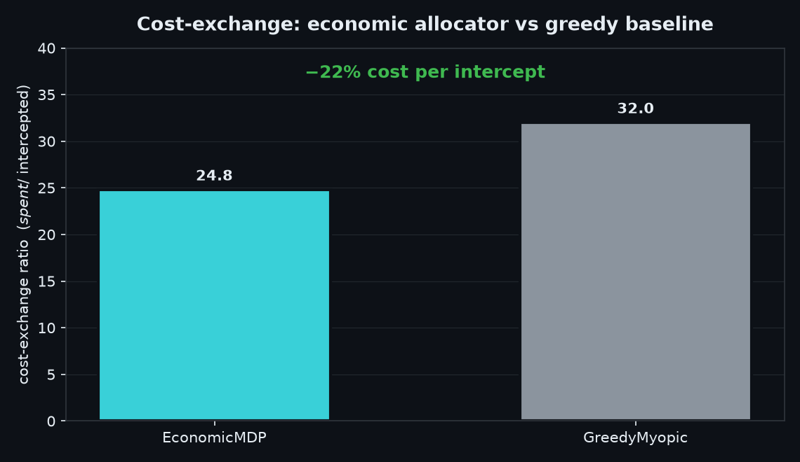
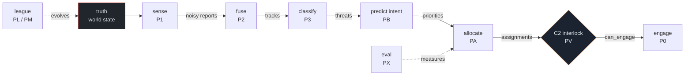

<p align="center">
  
</p>

<p align="center">
  
  
  
  
  
  
  
</p>

# GRECKO

**GRECKO** is a counter-swarm air-defense **decision engine** — named for the
gecko: small, fast, adhesive, adaptive. It wins the engagement the way a gecko
does, by **agility and economics**, not by out-spending the threat.

It models the full sense → fuse → classify → predict → allocate → engage loop
against adversarial UAS swarms, with a human-on-the-loop command-and-control
console and an adversarial co-evolution league that discovers attack tactics the
defense was never scripted against — then a mutual loop where the defense adapts
back. Packaged to deploy: a `grecko` CLI, containers, and a CI-gated scope
boundary.

The headline result: a magazine-conscious **economic allocator** neutralizes
swarm raids at a fraction of the cost-per-kill of legacy weapon-target-assignment
doctrine, and the advantage is largest against the adversarially-discovered
attacks.

> 📊 **Investor / project landing page** (problem, demo, competitive comparison):
> the GitHub Pages site is built from [`site/index.html`](site/index.html) and
> deployed by [`.github/workflows/pages.yml`](.github/workflows/pages.yml).

### Swarm for swarm — the same raid, two doctrines

Counter-swarm is fundamentally a **cost-exchange problem**: a $90,000 interceptor
against a $1,000 quadrotor is a losing trade even when it hits. The same 11-UAS
raid, run against a legacy weapon-target-assignment doctrine (left) and against
GRECKO (right), straight from the simulator:

<p align="center"></p>

<p align="center"></p>

**GRECKO stops one _more_ threat for ~1% of the spend** — $6,400 vs $630,000.
Reproduce it with `python -m tools.make_demo_gif`.

---

## Scope boundary (read this first)

GRECKO is **simulation, research, and C2-software only.** It deliberately
contains none of the following, and a CI gate
(`python -m tools.verify_invariants`) enforces their absence:

- **No fire-control.** Nothing computes a firing solution or commands a launch.
- **No RF / jamming / waveform design.** Communications denial is an *abstract
  link-probability model*; the "EW" effector is a *kill-probability parameter*
  for the allocator, explicitly not a jammer or waveform.
- **No effector or weapon hardware control.** Effectors are **parameter sets**
  (cost, kill probability, kinematic envelope) consumed by the cost-exchange
  optimizer. There is no hardware API, no integration layer.

The simulation studies the *decision problem* — which interceptor, against
which threat, at what cost, under what authorization — not the kinetics of any
real effector.

---

## Headline result

Monte Carlo over adversarial attack formations (see `python demo.py`):

<p align="center"></p>

| Metric                    | EconomicMDP | GreedyMyopic |
|---------------------------|-------------|--------------|
| Cost-exchange ratio (CER) | **24.8**    | 32.0         |
| Intercept rate            | 33%         | 38%          |
| Mean defense spend / ep   | **$74,000** | $96,000      |

**~22% lower cost per intercepted threat**, trading off ~5 points of raw
intercept rate — the economic allocator rationally holds fire on low-value
feint tracks to preserve magazine for the main axis. The advantage is largest
(up to 34% CER reduction) on the attack patterns discovered by the
co-evolution league. Full reasoning in [docs/ADR-010.md](docs/ADR-010.md).

### Mutual co-evolution: Blue adapts back

The league evolves Red attacks against a fixed Blue; **mutual co-evolution**
(PM) then lets Blue adapt its effector loadout and rationing knob to those
discovered attacks. The finding is sharp: against cheap quadrotor swarms,
interceptor *capability* is not the binding constraint — intercept rate is
limited by the number of interceptors, not the effector — so **cost** is the
lever. The rational Blue fields cheap collision drones, cutting cost-per-intercept
**97.7% (≈43×, CER 34.4 → 0.8) at an _identical_ 25.8% intercept rate**, and
Red cannot claw the cost axis back (0 clawback after counter-evolution).
Re-validating across the PS reality gap, the cheaper Blue **preserves its
intercept rate** — cost adaptation is free on the capability axis.

<p align="center">
  
  
</p>

Full reasoning in [docs/ADR-012.md](docs/ADR-012.md).

---

## Architecture



*POSG discipline: everything right of `sense` reads only estimates — never the
truth node. The C2 interlock is the sole gate into `engage`.*

The world state is plain data; systems are pure functions over it. A fixed
50 Hz timestep (`DT = 0.02`) plus a seeded RNG make every run deterministic:
the SHA-256 of the JSONL event log is the acceptance criterion for replay.

The cardinal invariant is **POSG discipline** — nothing downstream of sensing
may read ground truth. Sensors consume truth and emit noisy, identity-free
`SensorReport`s; everything after that sees only estimates.

| Phase | Module | What it does |
|-------|--------|--------------|
| P0 | `sim/core` | World kernel, entities, kinematics, deterministic event log |
| P1 | `sim/sensing` | Heterogeneous imperfect sensor mesh (radar / EO-IR / acoustic) |
| P2 | `sim/fusion` | Kalman multi-target tracker, two-pass GNN association |
| P3 | `sim/classify` | Transparent, swappable threat classifier with provenance |
| PC | `sim/comms` | Degradable comms link-probability model (abstract) |
| PE | `sim/effectors` | Effector catalogue — **parameter sets only** |
| **PA** | `sim/alloc` | **Pillar A:** economic magazine-rationing allocator |
| **PB** | `learn/intent` | **Pillar B:** swarm-intent prediction, value multipliers |
| PV | `sim/bridge`, `viz` | Human-on-the-loop C2 console (WebSocket + TypeScript) |
| **PL** | `league` | **Pillar C:** adversarial co-evolution league (μ+λ ES) |
| PS | `s2r` | Sim-to-real validation strategy (reality-gap + gates) |
| PX | `eval` | Monte Carlo cost-exchange evaluation, headline figure |

The three **Pillars** (PA / PB / PL) are the research contributions; the other
phases are the substrate they need to be measured honestly.

Each phase has an architecture decision record in [`docs/`](docs/)
(ADR-000 … ADR-012).

---

## Quick start

```bash
pip install -e .            # installs the `grecko` CLI + deps

grecko version              # version + scope banner
grecko verify               # architectural invariant gate
grecko demo --fast          # headline cost-exchange study (~45 s)
grecko eval --seeds 6       # Monte Carlo evaluation, headline JSON
grecko serve                # C2 WebSocket bridge (ws://0.0.0.0:8765)

make test                   # full acceptance suite (305 tests)
make gif                    # render the swarm-for-swarm demo animation
```

`make help` lists every developer/operator target.

### The C2 console (human-on-the-loop)

```bash
grecko serve                          # decision-engine bridge
cd viz && npm install && npm run dev  # TypeScript C2 console
```

The console renders the live air picture with uncertainty ellipses, intent
forecasts, and the comms mesh; the operator authorizes, holds, or marks-friendly
each track. The HOTL interlock is an *architectural* property: `world.assign()`
is reachable on the production path only through `C2State.can_engage()`, and
the invariant verifier proves there is exactly one such guarded call site.

---

## Deploy

GRECKO ships as two containers — a C2 decision-engine bridge and an operator
console — with a non-root runtime, healthchecks, and a documented integration
boundary. Full guide in [`docs/DEPLOYMENT.md`](docs/DEPLOYMENT.md).

```bash
make docker-up      # docker compose up --build -d  (bridge :8765 + console :8080)
make docker         # build just the C2-server image
```

| `grecko` command | Purpose |
|------------------|---------|
| `grecko serve`   | start the C2 WebSocket bridge |
| `grecko verify`  | run the architectural invariant gate (CI) |
| `grecko demo`    | headline cost-exchange study |
| `grecko eval`    | Monte Carlo evaluation → headline JSON |
| `grecko figures` | regenerate result figures |

> **Integration boundary.** In an operational integration GRECKO consumes a
> track picture and emits *advisory* assignments under human authorization. It
> does not command effectors, compute firing solutions, or touch RF — effectors
> are parameter sets. That boundary is where real-world data attaches and where
> GRECKO deliberately stops (see `docs/DEPLOYMENT.md`).

---

## Hardening: the invariant gate

`python -m tools.verify_invariants` mechanically checks the four properties the
whole system rests on:

1. **POSG** — no production fusion module reads the truth sidecar.
2. **INTERLOCK** — exactly one `world.assign()` in the bridge, guarded by
   `can_engage()`.
3. **SCOPE** — no fire-control / RF-waveform / weapon vocabulary outside
   disclaimers and boundary tests.
4. **DETERMINISM** — a fixed scenario replays to a byte-identical log hash.

It exits non-zero on any violation, so it doubles as a CI gate.

---

## Repository layout

```
grecko/     operator CLI (grecko serve|verify|demo|eval|figures) + version
sim/        simulation kernel and the sense->...->engage pipeline
  core/     world, entities, kinematics, event log (P0)
  sensing/  imperfect sensor mesh (P1)
  fusion/   Kalman tracker + GNN association (P2)
  classify/ threat classifier (P3)
  comms/    abstract link-degradation model (PC)
  effectors/ parameter-set catalogue (PE)
  alloc/    economic allocator + greedy / oracle baselines (PA)
  bridge/   full-stack scenario + C2 WebSocket server (PV)
  tests/    acceptance suite, one file per phase
learn/      intent model + training (PB)
league/     adversarial co-evolution (PL) + mutual co-evolution (PM)
s2r/        sim-to-real validation strategy (PS)
eval/       Monte Carlo cost-exchange evaluation (PX)
viz/        TypeScript + Vite C2 console (PV) + nginx Dockerfile
tools/      invariant verifier, figure + demo renderers
docs/       ADR-000 … ADR-012, DEPLOYMENT.md, figures
Dockerfile · docker-compose.yml · Makefile · demo.py
```

---

## Determinism & reproducibility

Every result in this repository is reproducible from a seed. The simulation is
single-threaded, fixed-timestep, and seeded; the league, the sensitivity sweep,
and the Monte Carlo evaluation all thread their seeds explicitly. If a change
breaks replay determinism, `tools/verify_invariants.py` fails.
