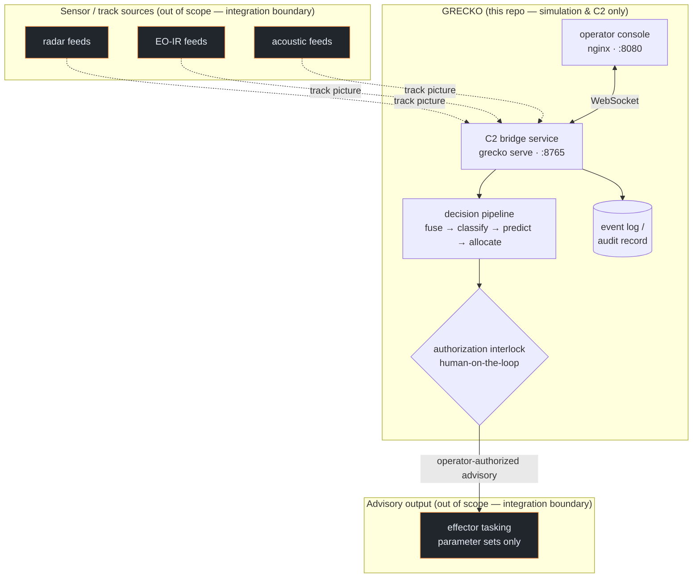

# GRECKO — Deployment Guide

GRECKO ships as two containers: a **C2 decision-engine bridge** (Python) and an
**operator console** (static TypeScript app served by nginx). Both are built and
run from this repository.

> **Scope.** GRECKO is simulation and C2-software only. In an operational
> integration it consumes a *track picture* and emits *advisory assignments*
> under human authorization. It does not command effectors, compute firing
> solutions, or touch RF. The integration boundary below is where real-world
> data would attach — and where GRECKO deliberately stops.

## Quick start

```bash
# whole stack (bridge :8765 + console :8080)
make docker-up        # docker compose up --build -d
# bridge only
make docker           # build image
docker run -p 8765:8765 grecko/c2-server:1.0.0
# or no containers at all
pip install -e . && grecko serve
```

The console connects to the bridge over WebSocket and renders the live air
picture, intent forecasts, comms mesh, and the audit trail; the operator
authorizes, holds, or marks-friendly each track.

## Runtime architecture



Everything inside the `grecko` box is in this repository and gated by tests. The
dashed edges are the **integration boundary**: in deployment, a site integrator
adapts real track sources onto the bridge's input contract and adapts GRECKO's
operator-authorized advisory assignments onto their own (separately certified)
effector tasking. GRECKO never crosses that line.

## Configuration

The bridge is configured by environment variables (see `Dockerfile`,
`docker-compose.yml`):

| Variable      | Default   | Meaning                          |
|---------------|-----------|----------------------------------|
| `GRECKO_HOST` | `0.0.0.0` | bind address for the WS bridge   |
| `GRECKO_PORT` | `8765`    | bridge port                      |
| `GRECKO_SEED` | `42`      | deterministic scenario seed      |

The console targets the bridge via its WebSocket URL (configured at build/serve
time in `viz/`).

## Operations

- **Health.** The bridge container ships a `HEALTHCHECK` that verifies the port
  accepts TCP. The console image health-checks its nginx root.
- **Determinism & audit.** Every run is reproducible from `GRECKO_SEED`; the
  JSONL event log is the audit record of record (SHA-256 verifiable). Ship it to
  durable storage and treat it as immutable.
- **Invariant gate.** `grecko verify` (CI on every push) proves the POSG, C2
  interlock, scope, and determinism properties still hold. Run it in your
  pipeline before promoting an image.
- **Scaling.** The simulation is single-threaded and deterministic by design;
  scale by running independent seeded instances (e.g. per evaluation shard),
  not by threading a single world.

## Security

See [`SECURITY.md`](../SECURITY.md). In short: run the non-root container user,
keep the bridge behind a TLS-terminating, authenticated reverse proxy, and never
expose the plaintext WS bridge to untrusted networks.

## Versioning

`grecko version` reports the running version. Images are tagged
`grecko/c2-server:<version>` and `grecko/console:<version>`; releases are
recorded in [`CHANGELOG.md`](../CHANGELOG.md).
